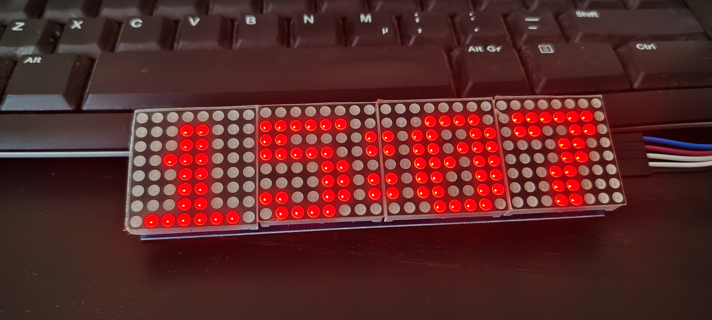

# RTC-Based LED Matrix Clock



A simple offline clock for an LED matrix display using a **DS3231 RTC** and the **MD_Parola** display library.

The project is based on the simple **"Hello World"** and font examples from the MajicDesigns libraries. Instead of displaying a fixed `"Hello"` message, the clock reads the current time from the DS3231 real-time clock and displays it on the LED matrix.

The clock does **not require an Internet connection or NTP time synchronization** while running.

## Features

* Offline clock based on a **DS3231 RTC**
* LED matrix display using **MD_Parola**
* Custom fonts supported
* Easy font creation and editing
* Configurable text alignment and character spacing
* Adjustable display brightness
* Simple and lightweight code
* No network connection required

## Hardware

The project is intended for an LED matrix built from **MAX7219 modules**.

The example configuration uses four modules with the `FC16_HW` hardware type.

The code can be adapted to different Arduino-compatible boards by changing the SPI pin configuration.

## Libraries

This project uses the following libraries from MajicDesigns:

* [MD_Parola](https://github.com/MajicDesigns/MD_Parola)
* [MD_DS3231](https://github.com/MajicDesigns/MD_DS3231)

`MD_DS3231` is used to read the current time from the RTC, while `MD_Parola` handles the LED matrix display.

## Fonts

One of the main reasons for using MD_Parola is the ability to easily create and modify custom fonts.

The fonts used by the project can be edited with the **MDParola Font Editor**:

https://pjrp.github.io/MDParolaFontEditor

The resulting font data is included in the project as `Font_Data.h`.

This makes it relatively easy to experiment with different digit styles and create a font specifically suited for the display.

## Display Configuration

Display-related settings are intentionally kept together in `setup()`.

For example:

* Font selection
* Character spacing
* Text alignment
* Display brightness

This means the appearance of the clock can be changed from the configuration section without having to modify the actual code that prints the time.

For example, the display can be configured to use a different font, change the spacing between characters, or switch between centered and other text alignments.

I chose this approach because I find it simpler and easier to maintain than putting formatting options directly into the same line where the text is displayed.

## Time Display

The clock reads the time from the DS3231 approximately twice per second.

The display alternates between:

```text
12:34
```

and:

```text
12 34
```

This provides a simple blinking-colon effect without requiring any animation or scrolling.

The RTC itself keeps the time, so the clock continues operating normally without network access.

## Setting the RTC

The DS3231 must be set to the correct time before using the clock.

Use a suitable RTC-setting program or another method to initialize the DS3231.

Once the RTC has been set, the clock can operate independently without an Internet connection.

## Design Philosophy

This is intentionally a **simple clock project**.

The code started from the basic MD_Parola `"Hello World"` example and was modified to read the time from the DS3231 instead of displaying a fixed message.

The goal was not to build a complicated clock framework, but to keep the implementation straightforward while still making the display configuration and fonts easy to modify.

In particular, keeping the display formatting settings together in `setup()` makes experimenting with fonts and layout much easier.

## License

This project is my own implementation based on examples and functionality provided by the libraries listed above.

Please refer to the individual library repositories for their respective licenses and terms.
